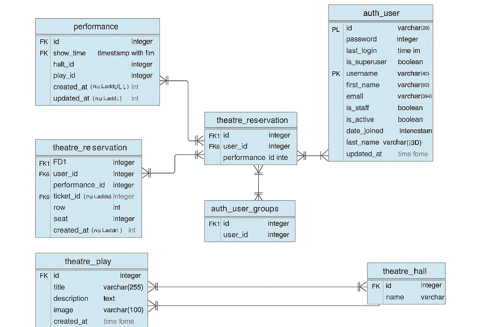
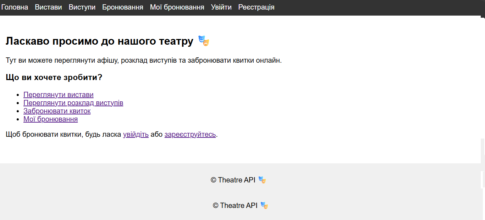
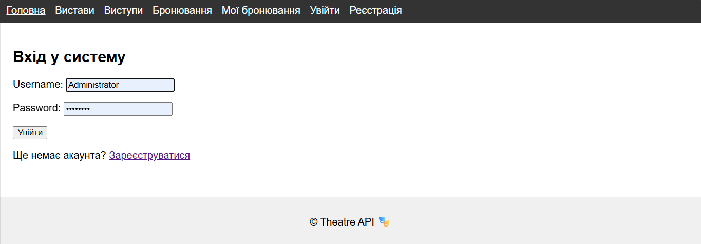
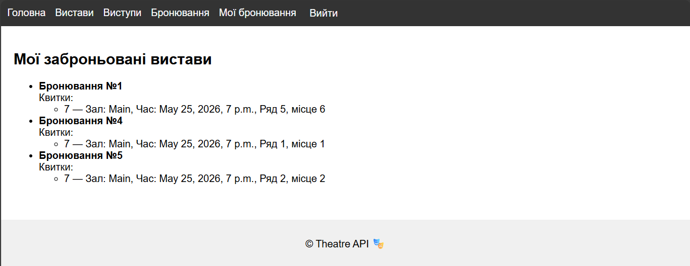
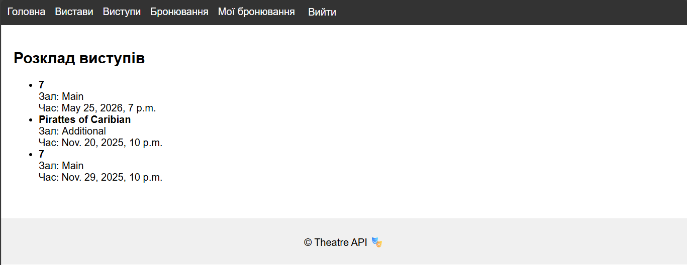
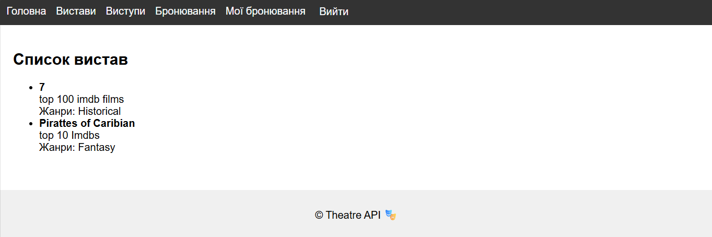
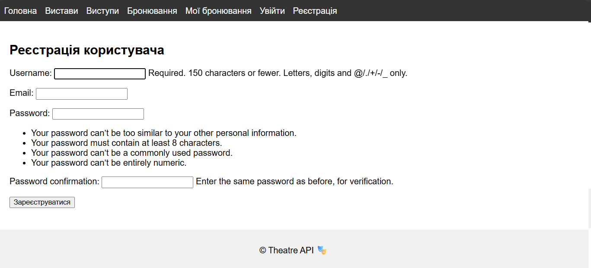
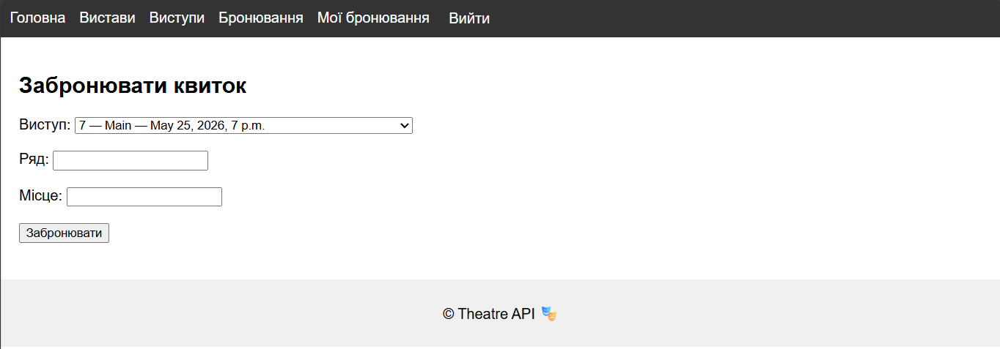

# 🎭 Theatre API

Theatre API is a Django web application for managing plays, performances, reservations, and tickets.  
Users can browse the repertoire, check the schedule, reserve seats, and manage their bookings.

## 🧾 Description

**Theatre API** is a Django web application designed to manage theatre operations.  
It provides both a user‑friendly HTML interface and a REST API for working with plays, performances, reservations, and tickets.

The platform allows users to:
- Browse the list of available plays 🎭
- View the schedule of performances with theatre halls and show times 🕒
- Reserve tickets by selecting row and seat 🎟️
- Check available seats for each performance before booking ✅
- Manage personal reservations and tickets in a dedicated section 👤
- Register, log in, and log out securely 🔑
- Use search, filtering, and pagination for plays and performances 🔍
- Access an admin panel with advanced filters and relations ⚙️

---

## 🧑‍💻 Technologies Used

- **Python 3.12** — core programming language  
- **Django 5.x** — main web framework for backend and REST API  
- **Bootstrap 5.3** — responsive frontend styling  
- **SQLite** (default) — lightweight database for local development  
- **Pillow** — image upload and processing support  
- **Pytest** — unit testing framework  
- **Django Extensions** — database visualization and developer utilities  

---

## ✨ Features

- **Custom user model** based on Django’s `AbstractUser`  
  - Fields: `username`, `email`, `first_name`, `last_name`  

- **CRUD functionality** for:
  - Plays 🎭  
  - Performances 🕒  
  - Reservations 🎟️  
  - Tickets  

- **Reservation system**  
  - Users can reserve seats by selecting row and seat number  
  - Validation prevents booking already occupied or non‑existent seats  
  - Success and error messages displayed in the HTML reservation form  

- **Custom actions**  
  - `free_seats_count` in `PerformanceViewSet` to check available seats before booking  

- **Search, filtering, and pagination**  
  - Search plays and performances by name, date, or hall  
  - Sort results by price, time, or title  
  - Pagination (10 items per page)  

- **Authentication & authorization**  
  - Login / Logout / Signup (auto login after registration)  
  - JWT support for secure API access  

- **Responsive UI**  
  - Bootstrap‑based design for a clean and mobile‑friendly interface  

- **Admin panel**  
  - Advanced filters and relations for managing plays, performances, and reservations  

- **Unit tests**  
  - Coverage for models and views to ensure reliability  

- **Database diagram and screenshots included**  
  - Located in `docs/db-diagram.png` and `docs/screenshots/`  

---

## 🧠 Database Diagram

Located in `docs/db-diagram.png`

---
## 📖 Usage Examples

### Web Interface
- **Home Page** — welcome screen with links to plays, performances, and reservations  
- **Plays Page** — list of available plays with descriptions  
- **Performances Page** — schedule of performances with halls and times  
- **Reservation Page** — form to book tickets by selecting row and seat  
- **My Reservations** — view all tickets booked by the logged‑in user  

### REST API Endpoints
- `GET /api/plays/` — list all plays  
- `GET /api/performances/` — list all performances  
- `GET /api/performances/{id}/free_seats_count/` — check available seats for a performance  
- `POST /api/reservations/` — create a new reservation  
- `GET /api/tickets/` — view user’s tickets  
---

## 🖼️ Screenshots

Located in `docs/`

| Page                     | Preview                                        |
|--------------------------|------------------------------------------------|
| 🏠 **Home**              |                  |
| 🔐 **Login page**        |                |
| 🧑‍🍳 **My-Reservation** |  |
| ➕ **Performances**       |   |
| 🍝 **Plays**             |        |
| 📄 **Register**          |    |
| 🧩 **Reservation**       |        |

---
## 🧪 Tests

 the application can be tested manually by:
- Registering a new user
- Logging in and making reservations
- Checking seat availability
- Using the admin panel to manage plays and performances

🛠️ Installation & Usage

1. Clone the repository
   git clone (https://github.com/IvDyriv/theatre_api)
   cd theatre_api

2. Create .env file
   
  SECRET_KEY=your-secret-key
  DEBUG=True
  ALLOWED_HOSTS=127.0.0.1,localhost
  
  POSTGRES_DB=theatre_db
  POSTGRES_USER=theatre_user
  POSTGRES_PASSWORD=your-password
  POSTGRES_HOST=db
  POSTGRES_PORT=5432

3. Build and run containers
   docker-compose up --build

4. Apply migrations
   docker-compose exec app python manage.py migrate

5. Create superuser
   docker-compose exec app python manage.py createsuperuser

6. Access the app
   Admin panel: http://127.0.0.1:8000/admin/
   API root: http://127.0.0.1:8000/api/

🧪 Run Tests
   docker-compose run app sh -c "python manage.py test"
